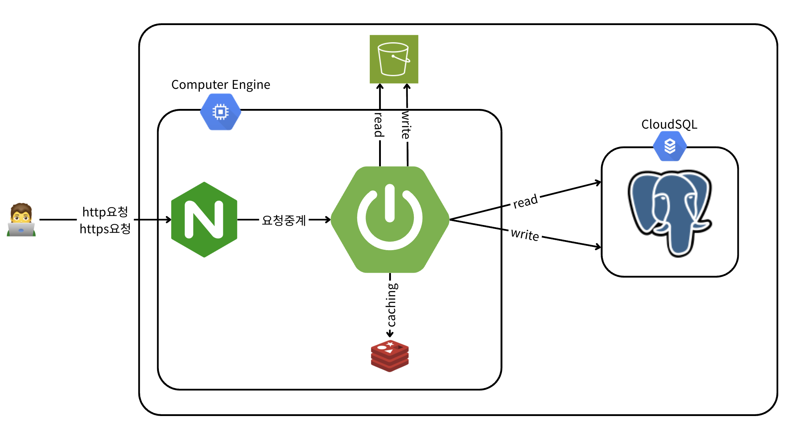
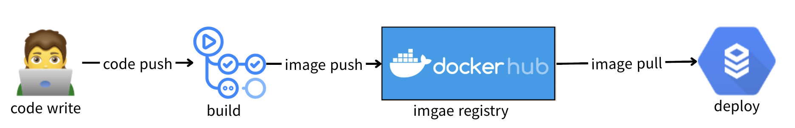
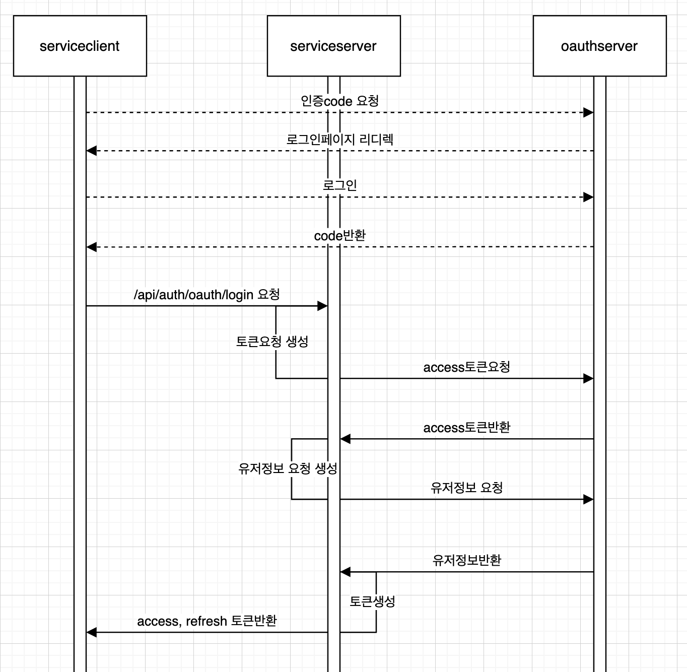

# MyLog 프로젝트

## 프로젝트 개요
MyLog는 사용자들이 블로그 형태로 게시글을 작성하고, 댓글을 달며, 카테고리와 태그를 활용해 콘텐츠를 관리할 수 있는 소셜 미디어 플랫폼입니다. 이 프로젝트는 Spring Boot를 기반으로 구축되었으며, 다양한 소셜 로그인(Google, Kakao, Naver)을 지원하고, AWS S3를 활용한 이미지 업로드, Redis를 사용한 리프레시 토큰 관리, 그리고 JWT 기반 인증 시스템을 포함합니다. 또한, Docker를 이용한 배포와 GitHub Actions를 활용한 CI/CD 파이프라인이 설정되어 있습니다.

## 주요 기능
- **사용자 관리**: 이메일 및 소셜 로그인(Google, Kakao, Naver)을 통한 회원가입 및 로그인
- **게시글 관리**: 게시글 생성, 조회, 수정, 삭제, 검색 및 태그 기반 검색
- **댓글 관리**: 댓글 및 대댓글 생성, 조회, 수정, 삭제
- **카테고리 관리**: 카테고리 생성, 조회, 수정, 삭제
- **알림 시스템**: 사용자 알림 생성, 조회, 읽음 처리 및 알림 설정 관리
- **이미지 업로드**: AWS S3를 통한 이미지 업로드 및 삭제
- **인증/인가**: JWT를 이용한 인증, 리프레시 토큰 관리
- **배포**: Docker Compose를 사용한 컨테이너화 및 GitHub Actions를 통한 CI/CD

## 기술 스택
- **백엔드**: Spring Boot, Spring Security, Spring Data JPA
- **데이터베이스**: (환경 변수로 설정, 예: MySQL/PostgreSQL)
- **캐싱**: Redis (리프레시 토큰 저장)
- **스토리지**: AWS S3 (이미지 저장)
- **인증**: JWT, OAuth2 (Google, Kakao, Naver)
- **빌드 도구**: Gradle
- **컨테이너화**: Docker, Docker Compose
- **CI/CD**: GitHub Actions
- **모니터링**: Sentry (에러 추적)
- **테스트**: JUnit, Mockito

## 프로젝트 구조
```plaintext
gratisreise-mylog/
├── docker-compose.yaml        # Docker Compose 설정
├── Dockerfile                 # Docker 이미지 빌드 설정
├── gradlew                    # Gradle Wrapper 스크립트 (Unix)
├── gradlew.bat                # Gradle Wrapper 스크립트 (Windows)
├── gradle/
│   └── wrapper/
│       └── gradle-wrapper.properties  # Gradle Wrapper 설정
├── src/
│   ├── main/
│   │   ├── java/
│   │   │   └── com/mylog/
│   │   │       ├── annotations/      # 커스텀 어노테이션
│   │   │       ├── common/           # 공통 응답 및 유틸리티 클래스
│   │   │       ├── config/           # Spring 설정 (JPA, JWT, S3, Redis 등)
│   │   │       ├── controller/       # REST API 컨트롤러
│   │   │       ├── dto/              # 데이터 전송 객체
│   │   │       ├── entity/           # JPA 엔티티
│   │   │       ├── enums/            # 열거형 (예: OAuth 제공자)
│   │   │       ├── exception/        # 커스텀 예외 및 전역 예외 처리
│   │   │       ├── repository/       # JPA 레포지토리
│   │   │       └── service/          # 비즈니스 로직 서비스
│   │   └── resources/
│   │       ├── application.yml       # 기본 설정
│   │       ├── application-dev.yml   # 개발 환경 설정
│   │       └── application-prod.yml  # 프로덕션 환경 설정
│   └── test/                         # 단위 테스트
└── .github/
    └── workflows/
        └── ci-cd.yaml                # GitHub Actions CI/CD 설정
```

## API 엔드포인트
주요 API 엔드포인트는 다음과 같습니다 (자세한 스펙은 Swagger UI 참조):
- **인증**
  - `POST /api/auth/login`: 이메일 로그인
  - `POST /api/auth/refresh`: 토큰 갱신
  - `POST /api/auth/oauth/login`: 소셜 로그인
- **회원**
  - `POST /api/members/sign-up`: 회원가입
  - `GET /api/members/me`: 개인 정보 조회
  - `PUT /api/members/me`: 개인 정보 수정
  - `DELETE /api/members/me`: 회원 탈퇴
- **게시글**
  - `POST /api/articles`: 게시글 생성
  - `GET /api/articles/{id}`: 게시글 조회
  - `PUT /api/articles`: 게시글 수정
  - `DELETE /api/articles`: 게시글 삭제
  - `GET /api/articles`: 전체 게시글 목록 조회
  - `GET /api/articles/me`: 내 게시글 목록 조회
  - `GET /api/articles/search`: 게시글 검색
  - `GET /api/articles/tag/{tagName}`: 태그로 게시글 검색
- **댓글**
  - `POST /api/comments`: 댓글 생성
  - `GET /api/comments/{articleId}`: 게시글 댓글 목록 조회
  - `GET /api/comments/{articleId}/{parentId}`: 대댓글 목록 조회
  - `PUT /api/comments`: 댓글 수정
  - `DELETE /api/comments/{commentId}`: 댓글 삭제
- **카테고리**
  - `POST /api/categories`: 카테고리 생성
  - `GET /api/categories`: 카테고리 목록 조회
  - `PUT /api/categories`: 카테고리 수정
  - `DELETE /api/categories`: 카테고리 삭제
- **알림**
  - `GET /api/notifications`: 알림 목록 조회
  - `PUT /api/notifications`: 알림 읽음 처리
  - `PUT /api/notifications/toggle`: 알림 설정 토글

[상세api스펙](mylog-api.click/swagger-ui/index.html)


## CI/CD 파이프라인
GitHub Actions를 통해 테스트, 빌드, 배포가 자동화되어 있습니다:
1. **테스트**: `gradlew test`를 실행해 단위 테스트 수행
2. **빌드 및 푸시**: Gradle로 애플리케이션 빌드 후 Docker 이미지를 생성하고 Docker Hub에 푸시
3. **배포**: EC2에 `.env` 및 `docker-compose.yaml`을 전송하고, 블루-그린 배포 방식으로 애플리케이션 배포

## 아키텍쳐
1. 소프트웨어 아키텍쳐


2. 배포 아키텍쳐


3. 인증/인가 

##

